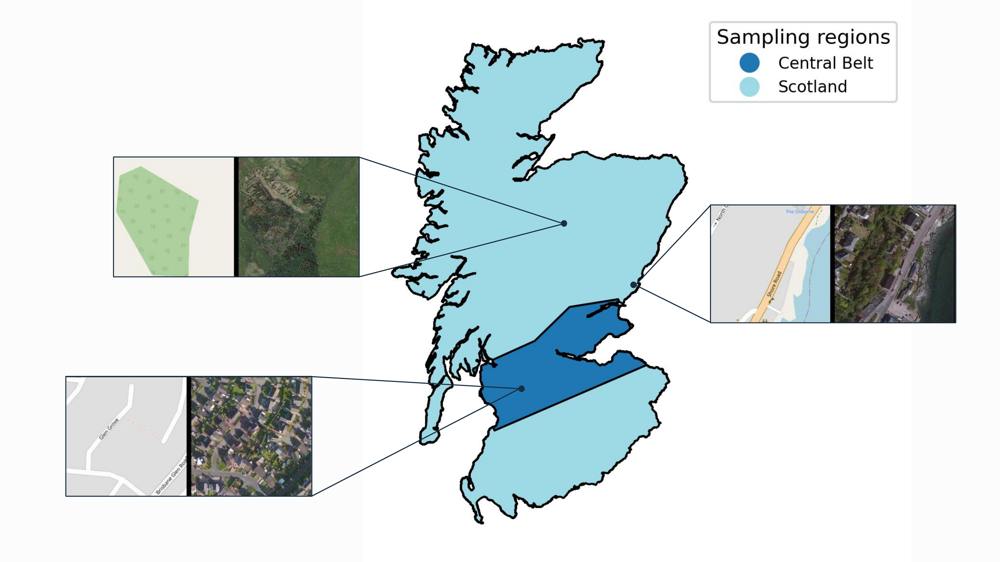

# ControlEarth
Code corresponding to the paper: _Generate Your Own Scotland: Satellite Image Generation Conditioned on Maps_.

> We show that state-of-the-art pretrained diffusion models can be conditioned on cartographic data to generate realistic satellite images. We train the ControlNet model and qualitatively evaluate the results, demonstrating that both image quality and map fidelity are possible.


The above image shows the results of our model. The first column shows the input map, the second column shows the real satellite image, and the rest show the generated satellite images with diffusion models (ControlNet) when conditioned on the OSM map.

## Installation
Create a conda environment and install the dependencies
```
conda create -n mapsat python=3.7
conda activate mapsat
pip install -r requirements.txt
```

## Steps
### Download and preprocess shapefiles
First, download the shapefile data for scotland. This will generate a folder called `country_data` with the shapefile data for the country of Great Britain.
```
./download_data.sh
```
Next, we will split the shapefile into the region of Scotland (merge into single file), and further select only mainland sctoland.
```
python create_shapefile_scotland.py
```

### Sample points
To sample points, we will use the script `generate_points.py`. This file will accept multiple command line arguments. It is required to specify the following:
- `--npoints`: the number of points to sample
- `--name`: the name of the region to sample points from. Currently the script only accepts: `edi` (edinburgh) or `sct` (scotland) or `central-belt` (central-belt)



For instance, to sample 1000 points from the central belt of Scotland, run the following:
```
python generate_points.py --npoints 1000 --name central-belt
```
This will generate a subfolder in `results/` called `central-belt1000` with the following files:
- `central-belt1000.html`: a folium dynamic visualisation of the sampled points in an interactive map.
- `central-belt1000.png`: a png image of the region with the sampled points
- `central-belt1000.npy`: a npy file containing the sampled points in the form of a numpy array of shape (npoints, 2), where the first column is the longitude and the second column is the latitude.

### Download tiles
Lastly, we will download the tiles using the script `download_tiles.py`. This script will accept the following command line arguments:
- `--pfile`: this is the identifier of the points file to use. For instance, if we want to use the points file `central-belt1000.npy`, then we would specify `--pfile central-belt1000`

For instance, to download the tiles for the points file `central-belt1000.npy`, run the following (assuming the points file has already been generated):
```
python download_tiles.py --pfile central-belt1000
```

The image below shows some paired samples from the different datasets as downloaded with the above script.

<p align="center">
  
</p>

## ControlEarth training
We train a ControlNet model with the built dataset using the code provided by the [diffusers library](https://github.com/huggingface/diffusers/tree/main/examples/controlnet). It is recommended to compile the dataset as a [huggingface dataset](https://huggingface.co/docs/datasets/index).

## Model weights

The best performing model, trained on the Central Belt dataset, is publicly available at https://huggingface.co/toastyfrosty/controlearth.

We also publish the model trained on Mainland Scotland at https://huggingface.co/toastyfrosty/controlearth-sct for comparative purposes.
